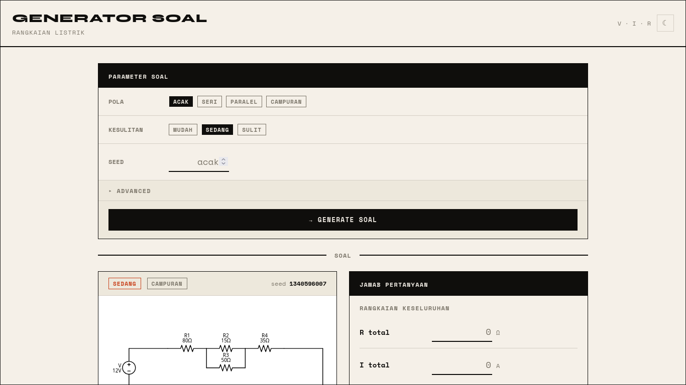
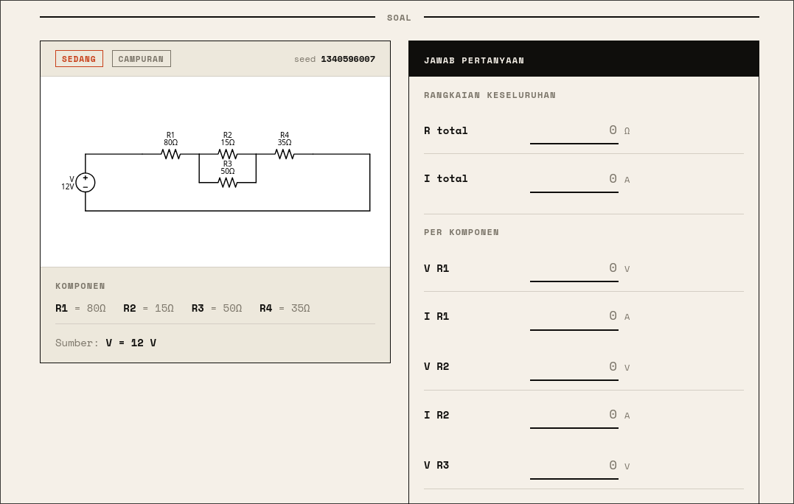

# Generator Soal Rangkaian Listrik

Aplikasi untuk membuat soal fisika rangkaian listrik secara otomatis — lengkap dengan gambar rangkaian, soal, dan kunci jawaban.

---

## Fitur

- **3 topologi rangkaian** — seri, paralel, dan campuran
- **3 tingkat kesulitan** — mudah, sedang, sulit
- **Gambar rangkaian otomatis** — setiap soal punya diagram yang digambar presisi
- **Kunci jawaban lengkap** — hambatan total, arus, dan tegangan per komponen
- **Soal tak terbatas** — nilai resistor dan topologi di-random setiap klik

---

## Download & Cara Pakai

> **Tidak perlu install Python, Node.js, atau software apapun.**

1. Buka halaman [**Releases**](../../releases/latest)
2. Download file `GeneratorRangkaian.zip`
3. Extract ZIP
4. Double-click `GeneratorRangkaian.exe`
5. Browser terbuka otomatis — langsung bisa dipakai

### Catatan untuk pengguna Windows

Jika muncul popup **"Windows protected your PC"**:
klik **More info** → **Run anyway**

Ini normal untuk aplikasi yang belum memiliki sertifikat digital berbayar. Aplikasi aman untuk dijalankan.

---

## Cara Generate Soal

| Langkah | Keterangan |
|---|---|
| Pilih **Topologi** | Seri / Paralel / Campuran — atau biarkan acak |
| Pilih **Kesulitan** | Mudah (nilai bulat), Sedang, Sulit (nilai desimal, lebih banyak komponen) |
| Klik **Generate** | Soal baru muncul beserta gambar rangkaian |
| Klik **Lihat Jawaban** | Tampilkan kunci jawaban lengkap |

---

## Lisensi

[MIT](LICENSE)